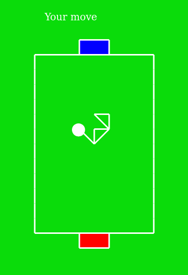

# Paper soccer

Paper soccer (or paper hockey) is an abstract strategy game played on a square grid representing a soccer or hockey field. Two players take turns to extend a line representing the position of a ball, until it reaches one of the grid's two goal spaces.

Description and game rules:
https://en.wikipedia.org/wiki/Paper_soccer

## Description

Mobile multiplayer game.

### Built With

* Cordova (client)
* NodeJS, WebSocket (server)

## Screenshots

